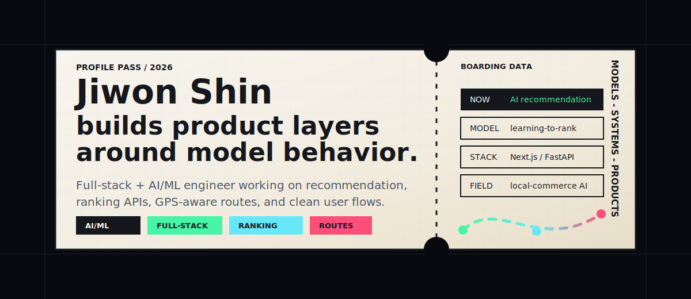

<div align="center">

  

  <br />
  <br />

  <a href="mailto:syrima03@gmail.com">
    
  </a>
  <a href="https://github.com/Jiwon-iii">
    
  </a>

</div>

---

```txt
FULL-STACK + AI/ML ENGINEER

I build product layers around model behavior:
recommendation systems, ranking APIs, GPS-aware routes,
and clean user flows that turn data into something usable.
```

## Index

| Key | Signal |
| --- | --- |
| `now` | Building an AI recommendation engine for nearby ranking and route generation |
| `model` | Learning-to-rank, cold-start strategy, collaborative filtering |
| `product` | Local-commerce AI, vertical SaaS, GPS-aware user workflows |
| `stack` | TypeScript, React, Next.js, Python, FastAPI, Java, Spring |

## Tools

<div align="center">

  

</div>

<br />

<div align="center">

  
  
  
  

</div>

## Work Log

| Project | Role |
| --- | --- |
| **Ground-AI** | AI recommendation work for nearby ranking, GPS-aware routes, and product-side ML integration |
| [AIsports-face-attendance](https://github.com/Jiwon-iii/AIsports-face-attendance) | Face-attendance workflow for sports and studio operations |
| [Portfoliopage](https://github.com/Jiwon-iii/Portfoliopage) | Personal portfolio UI and frontend presentation |
| [shop-nextjs-practice](https://github.com/Jiwon-iii/shop-nextjs-practice) | Commerce UI practice with modern frontend patterns |

## Activity

<div align="center">

  

</div>

---

<div align="center">

  <sub>models -> systems -> products -> shipped details</sub>

</div>
