<div align="center">

  

  <br />
  <br />

  <a href="mailto:syrima03@gmail.com">
    
  </a>
  <a href="https://github.com/Jiwon-iii">
    
  </a>

</div>

---

```txt
I like building things that become useful in real hands.

I work across frontend, backend, and AI/ML, with a bias toward
clear product flows, practical systems, and details that make
technology easier to use.
```

## About

- Full-stack + AI/ML engineer
- Interested in useful systems, recommendation logic, and product-side AI
- Comfortable moving between interface, API, and model-driven behavior
- Currently building around local-commerce AI and data-driven workflows

## Tools

<div align="center">

  

</div>

<br />

<div align="center">

  
  
  
  
  

</div>

## Work

| Project | Notes |
| --- | --- |
| **Ground-AI** | AI recommendation work for nearby ranking, GPS-aware routes, and product-side ML integration |
| [AIsports-face-attendance](https://github.com/Jiwon-iii/AIsports-face-attendance) | Face-attendance workflow for sports and studio operations |
| [Portfoliopage](https://github.com/Jiwon-iii/Portfoliopage) | Personal portfolio UI and frontend presentation |
| [shop-nextjs-practice](https://github.com/Jiwon-iii/shop-nextjs-practice) | Commerce UI practice with modern frontend patterns |

## Activity

<div align="center">

  

</div>

---

<div align="center">

  <sub>useful systems, shipped carefully</sub>

</div>
