  

## Hi, I'm Jiwon Shin

아이디어를 실제로 사용할 수 있는 제품으로 만드는 과정에 관심이 많은 개발자입니다.

프론트엔드, 백엔드, AI/ML을 오가며  
단순 기능 구현보다 **사용 흐름, 구조, 유지보수성**을 함께 고민합니다.

현재는 추천 로직, 위치 기반 서비스, 로컬 커머스 AI처럼  
데이터와 제품 경험이 만나는 영역을 중심으로 공부하고 만들고 있습니다.

---

## GitHub Activity

  

---

## Selected Projects

> 일부 프로젝트는 협업 및 보안상 Private Repository로 관리하고 있습니다.

- **Ground-AI**  
  AI 추천 엔진, 근처 장소 랭킹, GPS 기반 경로 생성 로직을 다루는 프로젝트입니다.

- [AIsports-face-attendance](https://github.com/Jiwon-iii/AIsports-face-attendance)  
  스포츠/스튜디오 운영 환경을 위한 얼굴 인식 출석 흐름을 다룬 프로젝트입니다.

- [Portfoliopage](https://github.com/Jiwon-iii/Portfoliopage)  
  개인 포트폴리오 UI와 프론트엔드 표현을 실험한 프로젝트입니다.

- [shop-nextjs-practice](https://github.com/Jiwon-iii/shop-nextjs-practice)  
  Next.js 기반 커머스 UI와 프론트엔드 패턴을 연습한 프로젝트입니다.

---

## Tech Stack

### Frontend

### Backend

### AI / ML

---

## Key Strengths

- **제품 흐름 중심 개발**: 사용자가 실제로 만나는 흐름을 기준으로 기능을 설계합니다.
- **전방위 구현 경험**: 프론트엔드, 백엔드, AI/ML 로직을 함께 연결해봅니다.
- **추천/랭킹 관심**: Learning-to-Rank, cold-start, 위치 기반 추천에 관심이 있습니다.
- **꾸준한 개선**: 작은 기능도 구조와 유지보수성을 생각하며 다듬습니다.

---

## Contact

  
  

---

  

