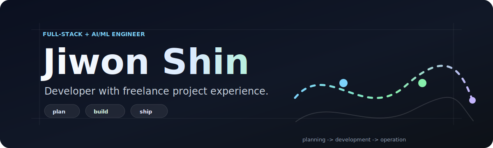

<div align="center">

  

  <br/>
  <br/>

  <a href="https://github.com/Jiwon-iii">
    
  </a>

</div>

<br/>

## 👋 Hi, I'm Jiwon Shin

외주 프로젝트로 **기획 → 개발 → 운영**까지 제품이 만들어지는 전 과정을 경험한 개발자입니다.
프론트엔드 · 백엔드 · AI/ML을 오가며, 단순 기능 구현보다 **사용 흐름 · 구조 · 유지보수성**을 함께 고민합니다.

지금은 **추천 로직 · 위치 기반 서비스 · 로컬 커머스 AI**처럼 데이터와 제품 경험이 만나는 영역을 중심으로 만들고 있어요.

```ts
const jiwon = {
  role:    ["Frontend", "Backend", "AI / ML"],
  focus:   ["Learning-to-Rank", "Cold-start", "Location-based Recsys"],
  mindset: "제품 흐름부터 설계한다 — 화면 뒤의 구조까지.",
};
```

---

## 🛠 Tech Stack

<div align="center">

  <table>
    <tr>
      <td align="right"><b>Frontend</b></td>
      <td></td>
    </tr>
    <tr>
      <td align="right"><b>Backend</b></td>
      <td></td>
    </tr>
    <tr>
      <td align="right"><b>Data / Infra</b></td>
      <td></td>
    </tr>
    <tr>
      <td align="right"><b>AI / ML</b></td>
      <td>
        
        
        
      </td>
    </tr>
  </table>

</div>

---

## 📊 GitHub Stats

<div align="center">

  
  

  <br/>

  

  <br/>
  <br/>

  

</div>

---

## 📌 Selected Projects

> 대부분의 프로젝트는 협업·보안상 **Private Repository**로 관리하고 있습니다.

| | Project | What I built |
|:--:|:--|:--|
| 🗺 | **AI 추천 / 위치 기반** | 근처 장소 랭킹 · GPS 기반 경로 생성 · 실시간 추천 로직 |
| 🥋 | **스포츠 운영 자동화** | 출석 · 운영 관리 · 사용자 흐름 설계 SaaS |
| 🛒 | **로컬 커머스 UI** | Next.js 기반 서비스형 UI 패턴 · 반응형 화면 구성 |
| 💼 | **포트폴리오 / 웹 UI** | 프론트엔드 표현 · 인터랙션 실험 |

---

## 💡 Key Strengths

- **외주 기반 실전 경험** — 요구사항 정리부터 개발 · 수정 대응 · 운영까지 직접
- **제품 흐름 중심 개발** — 사용자가 실제로 만나는 흐름 기준으로 기능 설계
- **전방위 구현** — 프론트 · 백엔드 · AI/ML 로직을 하나로 연결
- **추천 / 랭킹 관심** — Learning-to-Rank · cold-start · 위치 기반 추천

---

<div align="center">

  <a href="mailto:syrima03@gmail.com">
    
  </a>
  <a href="https://github.com/Jiwon-iii">
    
  </a>

  <br/>
  <br/>

  

</div>
